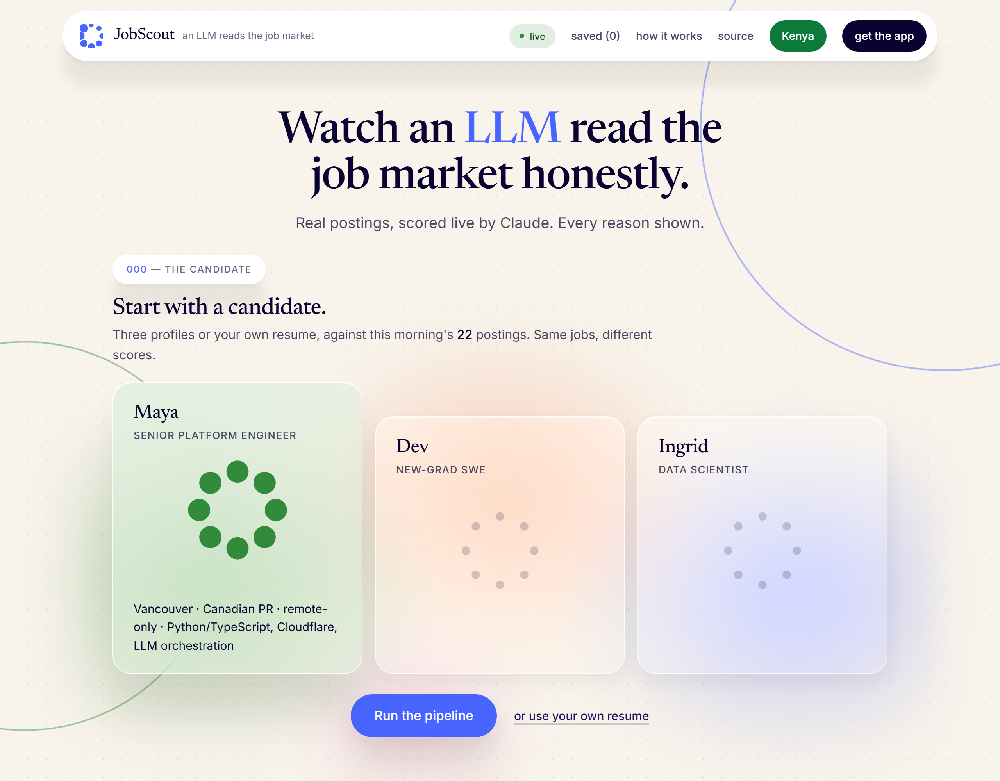
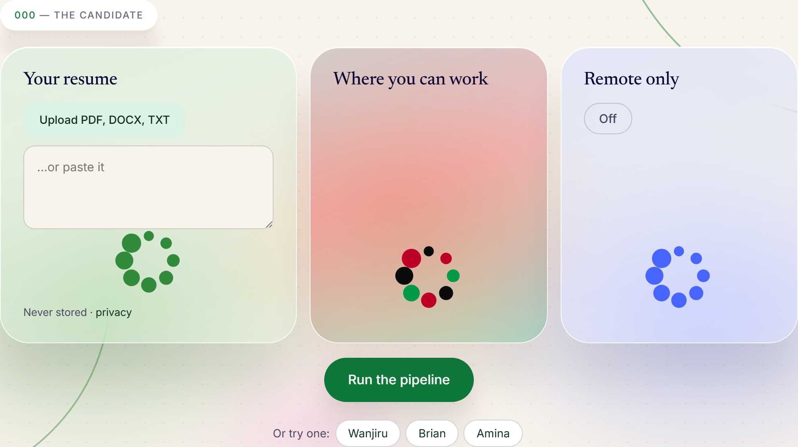
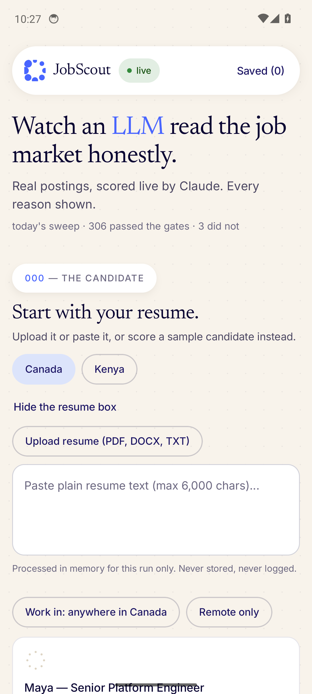
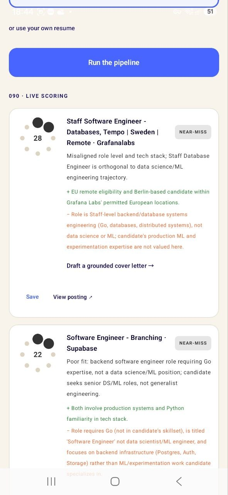
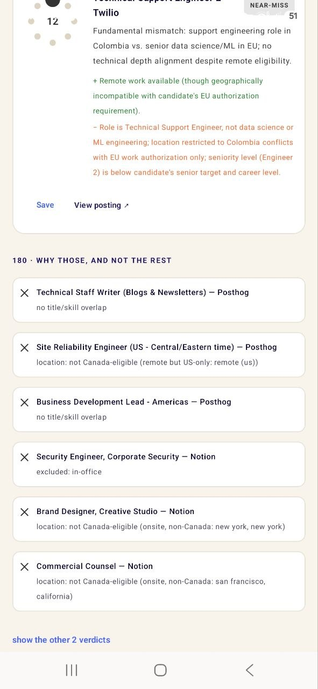

# JobScout — AI job-search copilot

**Live demo: [jobscout.page](https://jobscout.page)** — real job
postings, scored live by an LLM against a real candidate profile, with the reasoning
shown.

Built from the private pipeline that has run the author's own job search in
production since July 2026. The demo is not a mock: the postings are that
pipeline's actual daily sweep, the eligibility verdicts are its production
prefilter's own reasons, and every score and cover letter is a live Claude call.

## The 90-second tour

1. **Add your resume** — upload a PDF, DOCX or TXT, or paste the text,
   processed in-memory for one run, never stored or logged. Say where you can
   work and whether it must be remote; both controls are built from the day's
   own sweep. (The three sample candidates were removed in September 2026:
   they asked the visitor to do the product's work before it had done any.)
2. **Live scoring.** The gate survivors go to Claude (Haiku-class) with an
   honest rubric — most postings are a poor fit and the model says so. Each
   result renders on the brand's **bearing rose** — the mark itself, carrying
   the data: fit 0–100 lights the eight bearings clockwise, and the band it
   lands in selects the route:
   `auto ≥80 · ping 70–79 · unsure 55–69 · near-miss <55`.
3. **Why those, and not the rest.** Underneath the results, the deterministic
   verdicts on every posting the sweep looked at: region-eligibility,
   fake-remote detection, title scope. Six stream and the rest sit behind a
   click. No tokens are spent saying no.
4. **Grounded cover letter** for the top match — drafted only from the profile
   shown, never inventing experience. Beside it, **Tailor the resume**: the
   profile's own experience reworded toward the posting, plus the honest part —
   what the posting asks for that the profile never mentions, for the candidate
   to add only if it is true. Every bullet must cite a phrase that is actually
   in the profile, and the worker drops any that cannot; prose alone could not
   stop the model padding.
5. **Save what's worth keeping.** A posting enters your saved list only when
   you say so, and only on your own device.

The results come first on purpose. The gate list is the receipts, not the
opening act — and prices are not quoted at the reader on any surface.


### When nothing fits

Most resumes will not clear the bar against a given day, and a product that
stops there is a dead end. Below a fit of 55 nothing is drafted by default —
the recommendation is to rewrite the resume, because that is what actually
moves the odds — but three routes sit on that screen, not one:

- **What to answer.** Each posting already carries the one thing it most wants
  to see that the resume does not evidence, written as a to-do rather than a
  verdict. The three nearest misses are quoted verbatim: that is the rewrite
  list, and it came from the run rather than from this screen.
- **Rework your resume and run again.** Back to the box with the text still in
  it. The same experience described in the posting's words often scores very
  differently.
- **Apply to these anyway.** One deliberate opt-in, after which every
  below-floor card offers the application page. The letter it writes is not
  the normal letter written regardless: it is told the overlap is not obvious,
  to find the strongest REAL parallel and lead with it, and to write about what
  the candidate has done rather than announce what they have not. It never
  claims the missing experience and it never argues against them either. The
  recruiter decides.

The floor is a rule about what may be CLAIMED. It was briefly also a rule
about what had to be CONFESSED, and the letters that produced — "I lack the
B2B SaaS analytics infrastructure experience this posting calls for" — would
not have been read past the first line. That was a bug, and it is fixed.

## Markets

One pipeline, two markets. **`ca`** is the default: the author's own hunt, the
private pipeline's verdicts as they are. **`ke`** is the Kenya market, live at
**[nairobi.jobscout.page](https://nairobi.jobscout.page)** (or `?market=ke`):
the same daily sweep re-gated for a hire based in Kenya — worldwide, EMEA and
Africa-open postings pass, a named place elsewhere rejects with the reason, no
remote word rejects, and any posting that asks the applicant for money rejects
hard. Three Kenyan candidates, and a rubric block that puts eligibility to be
hired from Kenya first, scores graduates against entry-level expectations and
counts programme training as evidence. The native apps carry a Canada/Kenya
switch above the candidates; one app, one package. Its sources, on top of the
shared sweep: JobWebKenya's feed, M-KOPA's Nairobi roles, and the boards that
hire worldwide or across EMEA and Africa (Canonical, Remote, Andela, Oyster);
ReliefWeb's jobs API, the UN and NGO sector Nairobi is a hub for, approved and live since 2026-09-15. Kenya-only
rows are marked at the source and the author's own pipeline rejects them on
sight, so they cost it nothing. BrighterMonday and Fuzu expose no feed or API.

<p>
  <a href="https://jobscout.page"></a>
  <a href="https://nairobi.jobscout.page"></a>
</p>

*The same page in its two markets: jobscout.page on the left, nairobi.jobscout.page on the right.*

## Architecture

```
visitor ── Cloudflare Pages (site/)
              │  /api/feed?market · /api/score · /api/letter · /api/tailor
         Cloudflare Worker (worker/)
              ├─ guard 1 · per-IP sliding-window rate limit (D1)
              ├─ guard 2 · global daily budget breaker (D1) — over cap,
              │            the demo says so and serves a cached real run
              ├─ Claude (Haiku-class) — scoring + letters, prompts server-side
              └─ D1 — feed, telemetry, cached showcase
              ▲
   droplet cron (tools/publish_feed.py) — sanitizes the private pipeline's
   daily sweep into a public-safe feed (titles/companies/locations/reasons;
   no scraped bodies, no scores, nothing profile-derived)
```

Design decisions in [docs/ARCHITECTURE.md](docs/ARCHITECTURE.md); the plain-English
walkthrough for non-readers-of-code in [docs/HOW-IT-WORKS.md](docs/HOW-IT-WORKS.md).

## Why the guards are features

A public AI endpoint with no auth is an invitation. The demo's answer is layered
and visible: Haiku-class model only, tight token caps, server-side prompts, a
per-visitor rate limit, and a global daily budget breaker that **degrades
honestly** — when the budget is spent it says so and serves a cached (real,
labeled) run rather than pretending.

The two guards are not the same guard, and it is worth being precise: the
per-IP window is **pacing** (anti-abuse), while `DAILY_BUDGET_USD` is the
**spend** ceiling. Raising the first cannot cost a cent more than leaving it
alone; only the second bounds money.

## Principles inherited from the parent pipeline

- **Honest scoring** — the rubric anchors a clean match near 70 and treats
  niches as bonuses, never requirements; bad fits get called bad fits.
- **Eligibility first, tokens second** — deterministic gates run before any
  paid call.
- **No auto-submission, anywhere** — in the private pipeline a human clicks
  every Submit, because applications carry legal attestations. The demo keeps
  that boundary as a design principle.

## Native apps (Kotlin + Swift)

The same demo, built fully native — no webview, no cross-platform wrapper.
Both apps speak to the same guarded worker API and now carry the **full web
design language**, not just its palette — the bearing rose, results before
gates, collapsed lists, one hue per candidate:

- **`android/`** — Kotlin + Jetpack Compose (Material 3, ViewModel/StateFlow,
  kotlinx-serialization, OkHttp; the rose is a Compose `Canvas` in
  [`Rose.kt`](android/app/src/main/java/trade/tbot/jobscout/Rose.kt)).
  Built in CI as a debug APK on every push, and as a signed AAB + APK on a
  `v*` tag for Google Play and the GitHub release.
- **`ios/`** — Swift + SwiftUI (async/await, `ObservableObject`, Codable; the
  rose is composed `Circle`s in [`RoseView.swift`](ios/Sources/RoseView.swift)).
  The `.xcodeproj` is generated in CI from [`project.yml`](ios/project.yml)
  (XcodeGen) — only sources are committed.

All three surfaces draw the rose from the **same geometry** — a 104-unit box,
eight dots on a ring of r=38 at 45° steps from bearing 000 — so the glyph is
identical on the web, on Android and on iOS. Nothing rotates in it, which is
deliberate: the dial it replaced turned a needle, and a rotation is the one
thing that can land off-canvas when its pivot is wrong.

**Try it on Android:** [download the APK](https://github.com/kenmwara/jobscout-app/releases/latest) (signed build, Android 8+, sideload; SHA-256 in the release notes) — the link always serves the newest build.

Both apps carry the full feature set: upload a resume (PDF/DOCX/TXT) instead of typing it, open the original posting from any score card, and keep the ones worth keeping — **Save** puts a posting in your list, and only then does it get a stage to move through (applied → pending → responded → interviewed → callback). Nothing is sent anywhere and the app never submits an application.

CI is [`codemagic.yaml`](codemagic.yaml), and all three workflows build green:
`android-debug` produces an installable APK on every Android push;
`android-release` runs on a `v*` tag and signs an AAB for Google Play plus the
APK the GitHub release carries, both under the same upload key, so a
sideloaded copy updates in place when the Play version lands; `ios-simulator`
proves the SwiftUI app compiles and links (device distribution waits on an
Apple Developer account). The Play listing is in **closed testing** (Play's
gate for a new personal account: 12 testers over 14 days before production);
the app targets Android 16 (API 36), which Play requires of new apps.

<p>
  
  &nbsp;&nbsp;
  
  &nbsp;&nbsp;
  
</p>

*Left — the setup screen, captured on an emulator in CI on the current build:
the resume first, then where you can work and remote only, with the sample
candidates below. Middle and right are Android on a real phone — live scoring
with the rose lit to each fit and the reasoning both ways, then the gate
verdicts sitting below the results as receipts.*

Captured by hand rather than in CI. The `android-screens` workflow now targets
`linux_x2`, which is the only instance that can run it — the emulator needs KVM
and `mac_mini_m2` is itself a VM that cannot nest virtualisation, so there the
emulator dies at boot with `HVF error: HV_UNSUPPORTED`. Linux is refused on the
free personal plan, so this waits on billing. A real device is the better
caption anyway.

## Deploying

> **Codemagic's changeset is computed since the last *successful* build.**
> `codemagic.yaml` filters on `android/` and `ios/` (and excludes `**/*.md`),
> but while no build has succeeded, every later non-Markdown push still
> "contains" the last native change and queues an iOS and an Android build
> again — a tools-only push queued two, and `[skip ci]` does not stop it.
> Builds run one at a time on a Mac mini, so a backlog reads as "queued"
> forever with no error; cancel through the API with a JSON body
> (`POST /builds/<id>/cancel -d '{}'` — an empty POST is 411). Separately,
> `[skip ci]` on the HEAD commit of a push skips the **GitHub** deploy for
> the whole push, so a site commit beneath it never deploys — push site
> commits on their own, or `gh workflow run deploy.yml --ref main`.
>
> **2026-09-20: the queue stopped dispatching altogether** — nothing started
> after 06:32Z, webhook- or API-triggered, on an Active pay-as-you-go account
> with minutes accruing and the status page green (the only visible change:
> free macOS minutes crossed 500). The `v0.9.1` release build sat `queued`
> with no message; Codemagic support ticket #20160. Play publishing is
> **manual** (no `publishing:` block): download the AAB from the build's
> artifacts and upload it in the Play Console.

Both halves deploy from a push to `main`, and neither needs a command run by hand.

| what | trigger | mechanism |
|---|---|---|
| `site/**` | push | GitHub Action → `wrangler pages deploy` |
| `android/**`, `ios/**` | push | GitHub webhook → Codemagic |
| signed AAB + APK | `v*` tag (a GitHub release creates one) | Codemagic `android-release`, `tbot_keystore` |
| `worker/**` | manual | `cd worker && wrangler deploy` |

The site's Pages project is **direct upload**, and Cloudflare cannot convert one
to a Git-connected project — *"If you choose Direct Upload, you cannot switch to
Git integration later."* Converting would mean a new project, a new
`.pages.dev` subdomain and re-pointing the custom domain, so
[`.github/workflows/deploy.yml`](.github/workflows/deploy.yml) runs the same
wrangler command instead. It needs one repository secret, `CLOUDFLARE_API_TOKEN`.

Codemagic triggering lives in [`codemagic.yaml`](codemagic.yaml): `triggering:`
picks the event and `when.changeset` decides whether it actually runs, so an
Android commit does not spend an iOS build. The two are **parallel**
workflow-level keys — `when` is not nested inside `triggering`. It also needs a
repository webhook pointing at `https://api.codemagic.io/hooks/<appId>`; without
one the YAML is correct and simply never fires.

## Stack

Cloudflare Pages + Workers + D1 · Anthropic Claude (Haiku) · Python (feed
publisher) · vanilla JS, one self-contained page · Kotlin/Jetpack Compose
(Android) · Swift/SwiftUI (iOS) · Codemagic CI · JobScout Brand Kit v2.1
(the bearing rose, the cream/indigo system, Newsreader + Inter embedded).

---
*Author: Ken Kariuki — [tbot.trade/portfolio](https://tbot.trade/portfolio) · ken@tbot.trade*
