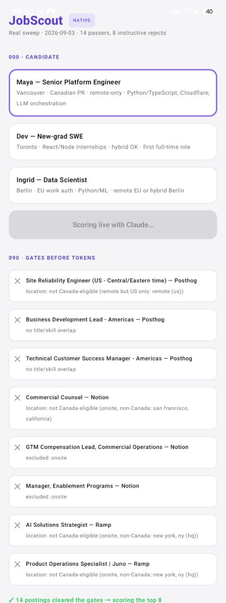
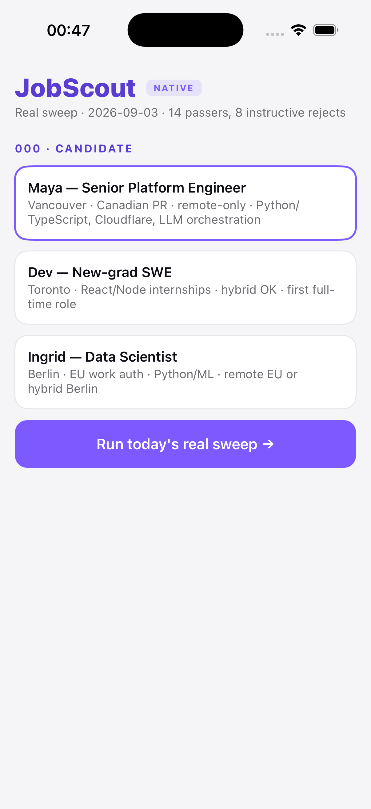

# JobScout — AI job-search copilot

**Live demo: [www.jobscout.tbot.trade](https://www.jobscout.tbot.trade)** — real job
postings, scored live by an LLM against a real candidate profile, with the reasoning
shown and the costs on the screen.

Built from the private pipeline that has run the author's own job search in
production since July 2026. The demo is not a mock: the postings are that
pipeline's actual daily sweep, the eligibility verdicts are its production
prefilter's own reasons, and every score and cover letter is a live Claude call.

## The 90-second tour

1. **Pick a candidate** (three personas) or paste your own resume text —
   processed in-memory for one run, never stored or logged.
2. **Eligibility gates.** Today's postings stream past with the pipeline's
   deterministic verdicts: region-eligibility for the candidate, fake-remote
   detection, title scope. Rejections show their reason. No tokens are spent
   saying no.
3. **Live scoring.** The survivors go to Claude (Haiku-class) with an honest
   rubric — most postings are a poor fit and the model says so. Each result
   renders on the brand's bearing dial: **the needle is the score** (fit 0–100
   sweeps 270°), and the band it lands on selects the route:
   `auto ≥80 · ping 70–79 · unsure 55–69 · near-miss <55`.
4. **Grounded cover letter** for the top match — drafted only from the profile
   shown, never inventing experience.
5. **The honest footer**: model, per-run cost, today's spend against the budget.

## Architecture

```
visitor ── Cloudflare Pages (site/)
              │  /api/feed · /api/score · /api/letter
         Cloudflare Worker (worker/)
              ├─ guard 1 · per-IP sliding-window rate limit (D1)
              ├─ guard 2 · global daily budget breaker (D1) — over cap,
              │            the demo says so and serves a cached real run
              ├─ Claude (Haiku-class) — scoring + letters, prompts server-side
              └─ D1 — feed, telemetry, cached showcase
              ▲
   droplet cron (tools/publish_feed.py) — sanitizes the private pipeline's
   daily sweep into a public-safe feed (titles/companies/locations/reasons;
   no scraped bodies, no scores, nothing profile-derived)
```

Design decisions in [docs/ARCHITECTURE.md](docs/ARCHITECTURE.md); the plain-English
walkthrough for non-readers-of-code in [docs/HOW-IT-WORKS.md](docs/HOW-IT-WORKS.md).

## Why the guards are features

A public AI endpoint with no auth is an invitation. The demo's answer is layered
and visible: Haiku-class model only, tight token caps, server-side prompts, a
per-visitor rate limit, and a global daily budget breaker that **degrades
honestly** — when the budget is spent it says so and serves a cached (real,
labeled) run rather than pretending. The cost telemetry in the footer is the
same discipline the parent pipeline applies to itself.

## Principles inherited from the parent pipeline

- **Honest scoring** — the rubric anchors a clean match near 70 and treats
  niches as bonuses, never requirements; bad fits get called bad fits.
- **Eligibility first, tokens second** — deterministic gates run before any
  paid call.
- **No auto-submission, anywhere** — in the private pipeline a human clicks
  every Submit, because applications carry legal attestations. The demo keeps
  that boundary as a design principle.

## Native apps (Kotlin + Swift)

The same demo, built fully native — no webview, no cross-platform wrapper.
Both apps speak to the same guarded worker API and re-implement the brand-kit
bearing dial in each platform's own graphics layer:

- **`android/`** — Kotlin + Jetpack Compose (Material 3, ViewModel/StateFlow,
  kotlinx-serialization, OkHttp; the dial is a Compose `Canvas` with an
  animated needle). Built in CI as a debug APK.
- **`ios/`** — Swift + SwiftUI (async/await, `ObservableObject`, Codable; the
  dial is trimmed-`Circle` band segments plus a `Path` needle under
  `rotationEffect`). The `.xcodeproj` is generated in CI from
  [`project.yml`](ios/project.yml) (XcodeGen) — only sources are committed.

CI is [`codemagic.yaml`](codemagic.yaml), and both workflows build green:
`android-debug` produces an installable APK; `ios-simulator` proves the
SwiftUI app compiles and links (device distribution waits on an Apple
Developer account).

<p>
  
  &nbsp;&nbsp;
  
</p>

*Left — Android on a real phone: the day's sweep streaming the deterministic gates with the pipeline's own reject reasons, then live scoring. Right — iOS, captured by the CI simulator step: the candidate chooser with the real feed already loaded.*

## Stack

Cloudflare Pages + Workers + D1 · Anthropic Claude (Haiku) · Python (feed
publisher) · vanilla JS, one self-contained page · Kotlin/Jetpack Compose
(Android) · Swift/SwiftUI (iOS) · Codemagic CI · JobScout Brand Kit v1.0
(the bearing dial, the violet system, Inter/JetBrains embedded).

---
*Author: Ken Kariuki — [tbot.trade/portfolio](https://tbot.trade/portfolio) · ken@tbot.trade*
