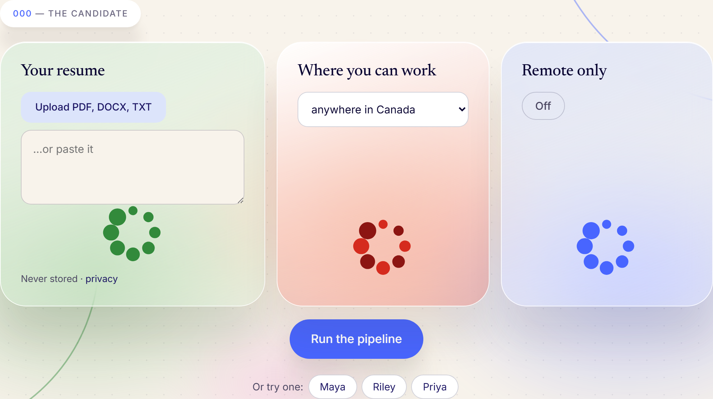
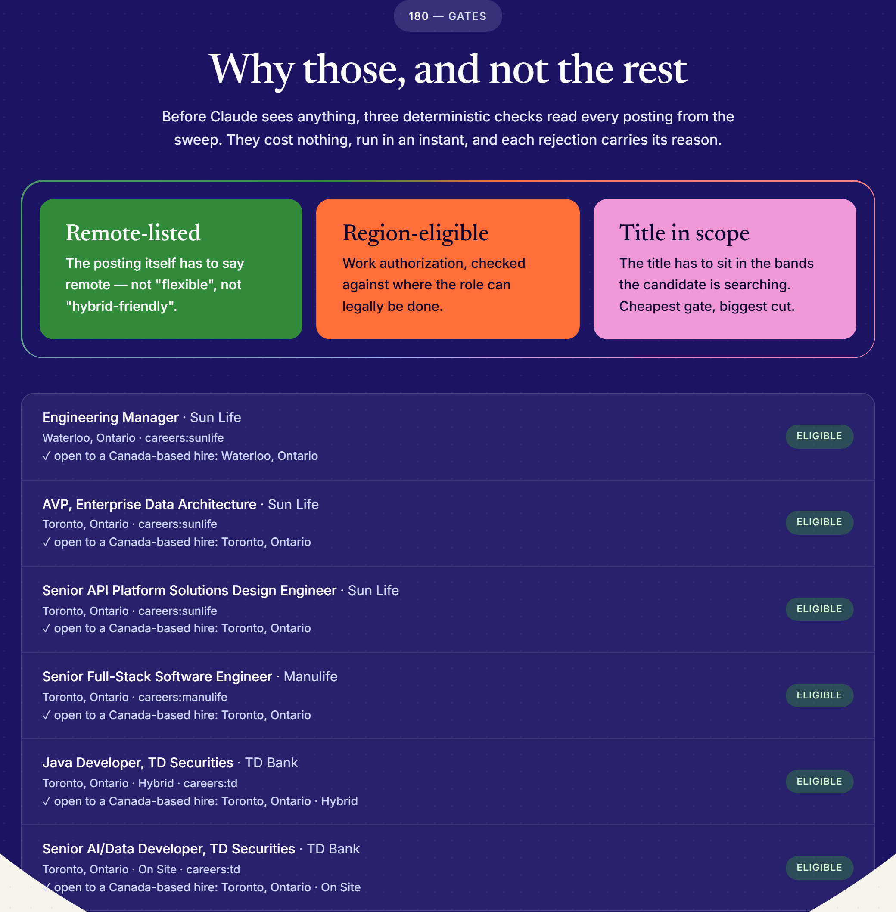
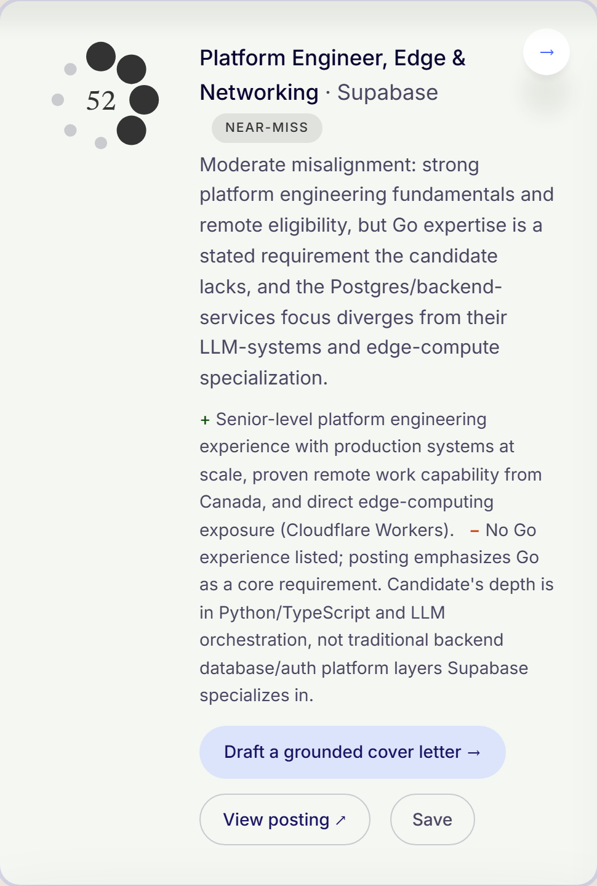

# JobScout — how it works (the two-minute version)
<!-- Employer-facing brief. Plain language on purpose. 2026-09-03 -->

**Try it: [jobscout.page](https://jobscout.page) · source: [github.com/kenmwara/jobscout-app](https://github.com/kenmwara/jobscout-app)**

## What you're looking at

I built an autonomous job-search pipeline for my own search in July 2026 — it sweeps
~1,800 postings a day from five job boards, about 800 company career feeds, five Canadian
banks and insurers via Workday, and two Kenyan sources,
filters them deterministically, scores the survivors with an LLM against my profile,
and hands me the judgment calls on Telegram. It found the interviews I'm in now.

This demo is that system's brain with a public face. Nothing in it is staged:
the postings are this morning's real sweep, the rejection reasons are the
production filter's own words, and every score and cover letter is a live
Claude call.

## The flow, in order

**1 · Candidate.** Three cards, in the order the work actually happens: your
resume, where you can work, and whether it has to be remote. The resume is the
point of the thing, so it leads — upload a PDF, DOCX or TXT, or paste the text,
processed in memory and never stored. Three sample candidates sit under the
button for anyone who would rather not hand over a resume to see the pipeline
run. Nothing is pre-selected, and a run with no candidate asks for one, so a
result on screen is always a result about someone.

The two filters are built from the day's own sweep, not a hardcoded list, so a
control can never offer a province the morning's postings cannot honour. A
posting is kept if it is remote, or names your province, or names no province
at all — that last clause matters, because around twenty-three postings a day
say only "Canada". No card states a count until its own control is used: a
number on an untouched control would read as the result of a search nobody ran.

**2 · Why those, and not the rest.** Every posting first passes deterministic
checks — is it genuinely remote, is the candidate's region actually eligible,
does it ask the applicant for money. This is free and instant, and it's where
most postings die. Design point: never spend AI money to discover what a rule
already knows. The survivors carry a sector tag (nineteen sectors, from a keyword
lexicon the feed ships with itself, tuned against a 66-profile regression harness);
the page reads the profile with the same
lexicon, ranks that sector's postings by the profile's own words, and sends only
the nearest eight to Claude, so a banker meets banking postings and an engineer
meets engineering ones, at the same cost.

On the page this sits *below* the results, as the receipts. The scores are what
the reader came for.

**3 · Honest scoring.** The survivors go to Claude with a rubric that anchors a
clean match near 70 and treats specialties as bonuses, never requirements. The
result renders on the bearing rose — the eight dots of the mark, lit clockwise
by the score, and the color band it lands in *is* the routing decision the real
pipeline makes
(auto-apply / ping me / unsure / near-miss). The top card is highlighted and
offered a cover letter or a tailored resume only from 55 up, and the API refuses
both below that; otherwise the page says nothing clears the bar and names the
nearest score. Most jobs score low. That is the
feature: the tool's job is to protect attention, not to flatter.

**4 · The letter, and the resume.** One click drafts a short cover letter
grounded only in the profile on screen — it cannot invent experience, by prompt
design. Another rewords the profile's own experience toward the posting and
lists what the posting asks for that the profile never mentions, for the
candidate to add only if true. A bullet survives only if it cites a phrase
that is really in the profile.

**A second market.** The same pipeline runs for Kenya at
[nairobi.jobscout.page](https://nairobi.jobscout.page): the day's sweep
re-gated for a hire based in Kenya, three Kenyan candidates, and a rubric that
asks first whether the employer can hire from Kenya at all — the question most
"remote" postings answer only after a week of applying. The location card there
offers no picker, because 105 of the 110 on-site Kenyan postings give their
location as the single word "Kenya" — the sources do not publish a town, so the
page does not invent one.

## The engineering underneath

- **Edge-native**: Cloudflare Pages + a Worker + D1 (SQLite at the edge). The
  AI calls, prompts, rate limits, and budgets all live server-side.
- **Guarded by construction**: a per-visitor rate limit and a global daily
  budget breaker. When the day's budget is spent, the demo *says so* and serves
  a cached, labeled, real run — it degrades honestly instead of pretending.
- **Cheap on purpose**: a full run (gates + 8 live scores) costs about one cent
  on a Haiku-class model — which is why the budget breaker, not the rate limit,
  is what bounds the spend.
- **Measured, not guessed**: thirteen named events record which steps people
  actually use, through to what happened after an application — applied,
  replied, interview, declined, marked by the person it happened to. The name
  must be on an allowlist inside the Worker, and an event carries no IP, no
  resume text, no job title and no company. The totals are public at
  [jobscout.page/stats](https://jobscout.page/stats); what each event can and
  cannot contain is written out on the
  [privacy page](https://jobscout.page/privacy). The page had been redesigned
  three times on taste before this existed.
- **Separated by design**: the public demo reads a sanitized feed published by
  the private pipeline; it can see titles and verdicts, never private data.
  In the private system, the same separation keeps the reporting path unable
  to touch the applying path — and a human clicks every Submit, because job
  applications carry legal attestations.

## Why it's relevant to an AI-app role

It demonstrates the full loop most AI demos skip: real data in, deterministic
pre-processing, LLM orchestration with an opinionated rubric, structured
output rendered as product (the rose), cost/abuse controls a public endpoint
actually needs, and honest degradation states — designed, built, shipped, and
operated by one person.

The same demo also ships as **fully native mobile apps** — Kotlin/Jetpack
Compose on Android and Swift/SwiftUI on iOS, no webview — built green in
Codemagic CI against the same guarded API. They run the same selection as the
page, not a simplified one: the sector lexicon that travels inside the feed
classifies the profile on the device, the same IDF ranking picks the eight that
go to Claude, and the 55 floor governs what gets drafted. The Android app installs on any phone today —
**download: [github.com/kenmwara/jobscout-app/releases/latest](https://github.com/kenmwara/jobscout-app/releases/latest/download/JobScout-release.apk)**
(signed, sideload, Android 8+; checksum in the release notes) — and is in
closed testing on Google Play ahead of a public listing; iOS device
distribution awaits an Apple Developer account.

— Ken Kariuki · ken@tbot.trade · [tbot.trade/portfolio](https://tbot.trade/portfolio)
