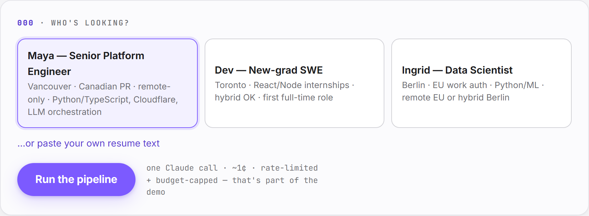
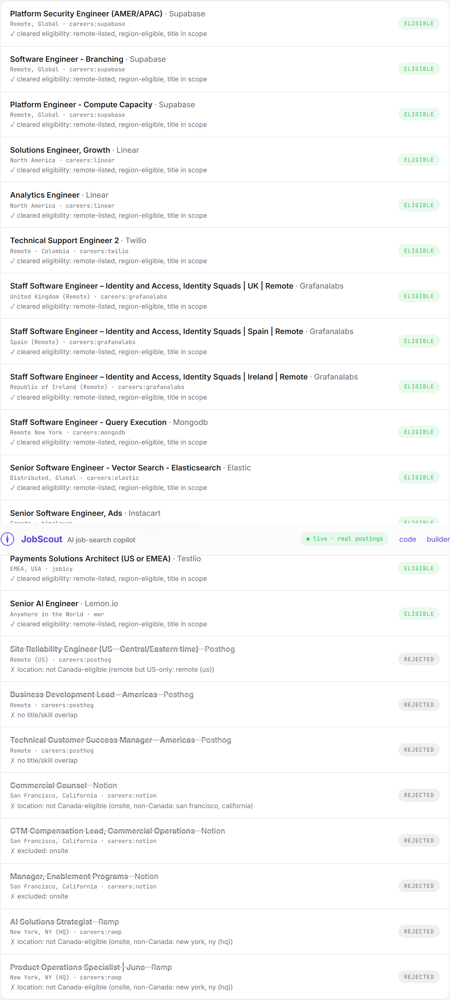
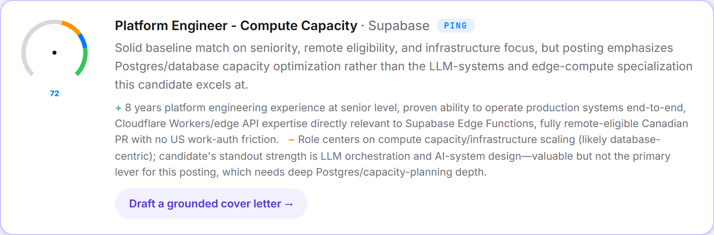

# JobScout — how it works (the two-minute version)
<!-- Employer-facing brief. Plain language on purpose. 2026-09-03 -->

**Try it: [www.jobscout.tbot.trade](https://www.jobscout.tbot.trade) · source: [github.com/kenmwara/jobscout-app](https://github.com/kenmwara/jobscout-app)**

## What you're looking at

I built an autonomous job-search pipeline for my own search in July 2026 — it sweeps
~1,400 postings a day from five job boards plus about 800 company career feeds,
filters them deterministically, scores the survivors with an LLM against my profile,
and hands me the judgment calls on Telegram. It found the interviews I'm in now.

This demo is that system's brain with a public face. Nothing in it is staged:
the postings are this morning's real sweep, the rejection reasons are the
production filter's own words, and every score and cover letter is a live
Claude call whose cost prints at the bottom of the page.

## The flow, in order

**1 · Candidate.** You pick one of three personas (or paste a resume, which is
processed in memory and never stored). This is the profile the AI reads against.

**2 · Gates before tokens.** Every posting first passes deterministic checks —
is it genuinely remote, is the candidate's region actually eligible, is the
title in scope. This is free and instant, and it's where most postings die.
Design point: never spend AI money to discover what a rule already knows.

**3 · Honest scoring.** The survivors go to Claude with a rubric that anchors a
clean match near 70 and treats specialties as bonuses, never requirements. The
result renders on a bearing dial — the needle's angle *is* the score, and the
color band it lands in *is* the routing decision the real pipeline makes
(auto-apply / ping me / unsure / near-miss). Most jobs score low. That is the
feature: the tool's job is to protect attention, not to flatter.

**4 · The letter.** One click drafts a short cover letter grounded only in the
profile on screen — it cannot invent experience, by prompt design.

## The engineering underneath

- **Edge-native**: Cloudflare Pages + a Worker + D1 (SQLite at the edge). The
  AI calls, prompts, rate limits, and budgets all live server-side.
- **Guarded by construction**: a per-visitor rate limit and a global daily
  budget breaker. When the day's budget is spent, the demo *says so* and serves
  a cached, labeled, real run — it degrades honestly instead of pretending.
- **Cheap on purpose**: a full run (gates + 8 live scores) costs about one cent
  on a Haiku-class model. The footer shows the exact figure per run.
- **Separated by design**: the public demo reads a sanitized feed published by
  the private pipeline; it can see titles and verdicts, never private data.
  In the private system, the same separation keeps the reporting path unable
  to touch the applying path — and a human clicks every Submit, because job
  applications carry legal attestations.

## Why it's relevant to an AI-app role

It demonstrates the full loop most AI demos skip: real data in, deterministic
pre-processing, LLM orchestration with an opinionated rubric, structured
output rendered as product (the dial), cost/abuse controls a public endpoint
actually needs, and honest degradation states — designed, built, shipped, and
operated by one person.

— Ken Kariuki · ken@tbot.trade · [tbot.trade/portfolio](https://tbot.trade/portfolio)
